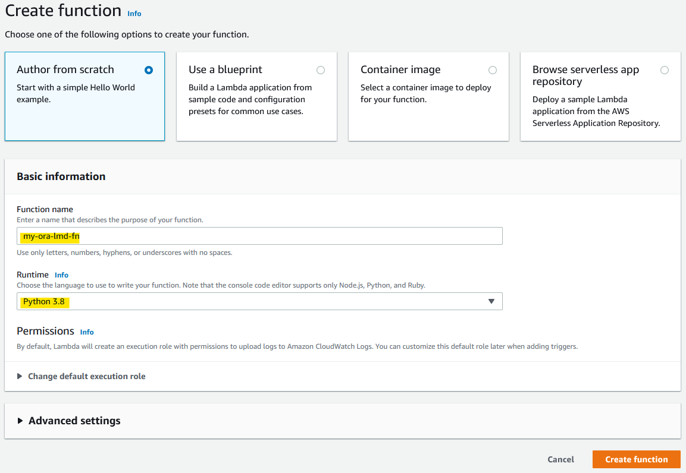
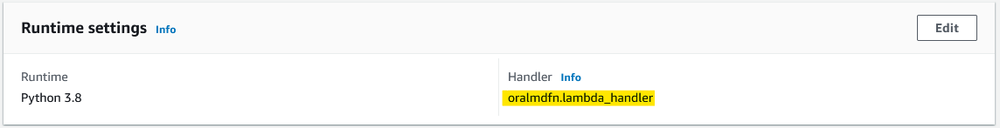
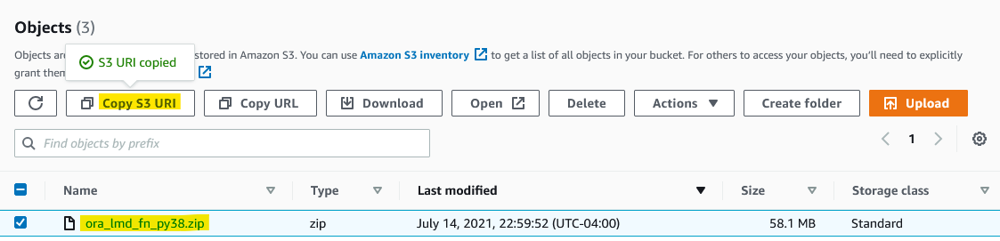
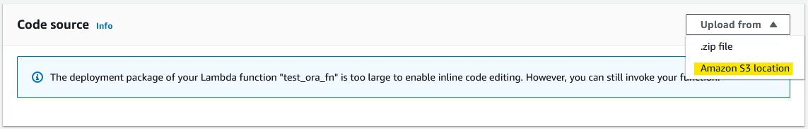
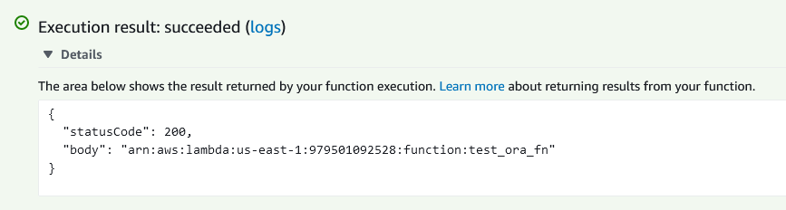

# lambda-function-for-oracle-db
> Lambda function to connect and query oracle RDS database

This article will explain how to create a AWS Lambda function to connect to Oracle (RDS) database and query data. 

Since lambda is based on linux environment its recommended to create this function on linux host. If you are using windows machine make use to WSL or VM or Docker.

**Prerequisites:**

1. Python 3.8
2. [cx_Oracle python module](https://pypi.org/project/cx-Oracle/#files)
3. [Oracle instant client](https://www.oracle.com/in/database/technologies/instant-client/linux-x86-64-downloads.html)
4. [libiao package](https://pkgs.org/download/libaio)

👆 Download and keep it ready

#### Step 1
Check the python version installed, AWS Lambda supports Python version 3.6/3.7/3.8 at the time of this article written.

```shell
$ python --version
Python 3.8.11
```

Step 2
Install pip

```shell
$ sudo apt install python3-pip

$ pip3 --version
pip 21.1.3 from /usr/local/lib/python3.8/site-packages/pip (python 3.8)
```

Step 3
Install Virtual Python Environment builder

```shell
$ pip3 install virtualenv
Collecting virtualenv
  Downloading virtualenv-20.6.0-py2.py3-none-any.whl (5.3 MB)
     |████████████████████████████████| 5.3 MB 2.5 MB/s
Collecting distlib<1,>=0.3.1
  Downloading distlib-0.3.2-py2.py3-none-any.whl (338 kB)
     |████████████████████████████████| 338 kB 4.4 MB/s
Collecting backports.entry-points-selectable>=1.0.4
  Downloading backports.entry_points_selectable-1.1.0-py2.py3-none-any.whl (6.2 kB)
Collecting filelock<4,>=3.0.0
  Downloading filelock-3.0.12-py3-none-any.whl (7.6 kB)
Collecting platformdirs<3,>=2
  Downloading platformdirs-2.0.2-py2.py3-none-any.whl (10 kB)
Collecting six<2,>=1.9.0
  Downloading six-1.16.0-py2.py3-none-any.whl (11 kB)
Installing collected packages: six, platformdirs, filelock, distlib, backports.entry-points-selectable, virtualenv
Successfully installed backports.entry-points-selectable-1.1.0 distlib-0.3.2 filelock-3.0.12 platformdirs-2.0.2 six-1.16.0 virtualenv-20.6.0
WARNING: Running pip as the 'root' user can result in broken permissions and conflicting behaviour with the system package manager. It is recommended to use a virtual environment instead: https://pip.pypa.io/warnings/venv      
/ # 
```
Step 4
Create virtual environment `oralmdfn`
```shell
$ virtualenv oralmdfn
created virtual environment CPython3.8.11.final.0-64 in 688ms
  creator CPython3Posix(dest=/oralmdfn, clear=False, no_vcs_ignore=False, global=False)
  seeder FromAppData(download=False, pip=bundle, setuptools=bundle, wheel=bundle, via=copy, app_data_dir=/root/.local/share/virtualenv)
    added seed packages: pip==21.1.3, setuptools==57.1.0, wheel==0.36.2
  activators BashActivator,CShellActivator,FishActivator,PowerShellActivator,PythonActivator,XonshActivator
```
Step 5
Activate virtual environment
```sh
$ source oralmdfn/bin/activate
(oralmdfn) $ 

# you will see the virtual environment name in () if activated 
```
Step 6
Install cx_Oracle module vai pip
Make sure you have downloaded the right version of cx_Oracle module. In this artical I use python 3.8 so i have downloaded `cx_Oracle-8.2.1-cp38-cp38-manylinux1_x86_64.whl` (👈cp38 is for python 3.8)

```shell
$ pip3 install cx_Oracle-8.2.1-cp38-cp38-manylinux1_x86_64.whl 
Processing ./cx_Oracle-8.2.1-cp38-cp38-manylinux1_x86_64.whl
Installing collected packages: cx-Oracle
Successfully installed cx-Oracle-8.2.1
```

verify cx-Oracle installation 
```shell
$ ls  oralmdfn/lib/python3.8/site-packages/cx*
oralmdfn/lib/python3.8/site-packages/cx_Oracle.cpython-38-x86_64-linux-gnu.so

oralmdfn/lib/python3.8/site-packages/cx_Oracle-8.2.1.dist-info
```

Step 7
Extract libiao rpm

install rpm2cpio package on linux
```shell
$ apt-get install rpm2cpio

$ apt-get install cpio # use this command to install cpio if not installed 

$ rpm2cpio lib64aio1-0.3.111-2pclos2020.x86_64.rpm | cpio -idmv
./usr/lib64/libaio.so.1
./usr/lib64/libaio.so.1.0.0
./usr/lib64/libaio.so.1.0.1
54 blocks
```

go to `usr/lib64/` 

```shell
$ ls -l $PWD/usr/lib64/
total 32
lrwxrwxrwx 1 root root    15 Jul 15 02:01 libaio.so.1 -> libaio.so.1.0.1
-rwxr-xr-x 1 root root 13536 Sep 22  2020 libaio.so.1.0.0
-rwxr-xr-x 1 root root 13536 Sep 22  2020 libaio.so.1.0.1

$ rm $PWD/usr/lib64/libaio.so.1   ## to remove the soft link 
$ cp $PWD/usr/lib64/libaio.so.1.0.1 $PWD/usr/lib64/libaio.so.1
```

Step 8
Create lambda function zip file

create a new directory 
```shell
$ mkdir ora_lmd_fn_py38
```
copy files and folders as mentioned below
```shell
$ cp -rp oralmdfn/lib/python3.8/site-packages/cx_Oracle* ora_lmd_fn_py38/
$ cp -rp instantclient_18_5/* ora_lmd_fn_py38/
$ cp usr/lib64/libaio.so.1 ora_lmd_fn_py38/
```

finally copy this [python script](oralmdfn.py) to the folder
```shell
$ cp oralmdfn.py ora_lmd_fn_py38/

$ ls ora_lmd_fn_py38/
BASIC_LITE_LICENSE                        genezi                 libipc1.so       libociicus.so     ojdbc8.jar
BASIC_LITE_README                         libaio.so.1            libmql1.so       libocijdbc18.so   oralmdfn.py
adrci                                     libclntsh.so           libnnz18.so      libons.so         ucp.jar
cx_Oracle-8.2.1.dist-info                 libclntsh.so.18.1      libocci.so       liboramysql18.so  uidrvci
cx_Oracle.cpython-38-x86_64-linux-gnu.so  libclntshcore.so.18.1  libocci.so.18.1  network           xstreams.jar
```

Step 9
Archive the `ora_lmd_fn_py38` folder with zip

```shell
$ cd ora_lmd_fn_py38/
$ zip -r ora_lmd_fn_py38.zip *
$ ls -lh *.zip
-rw-r--r-- 1 root root 58M Jul 15 02:38 ora_lmd_fn_py38.zip
```

Since our zip file is more than 10MB we need to upload to S3 bucket to add it to Lambda

Step 10 

Following steps to be performed on AWS management console

Step 10.1:
Create S3 bucket and upload `ora_lmd_fn_py38.zip` file to it

Step 10.2:
Create a lambda function 


Edit Handler as `oralmdfn.lambda_handler` (our python file name is `oralmdfn` and handler name is `lambda_handler`)


Step 10.3: 
Upload zip file from S3 to Lambda

Get zip file URI


Upload zip file to Lambda


Step 10.4:
Test the code

On lambda page click Test button 

Execution result: succeeded 👍


see Log output for query output

###### Feel free to reach me if any issues or open a issue on GitHub
